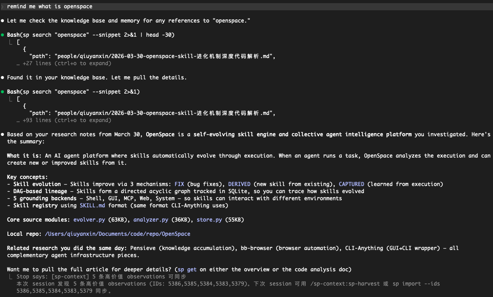

# sp-context

Your AI agent starts every session knowing nothing about your team. This fixes that.

**sp-context** is a CLI that gives any AI coding agent (Claude Code, Codex, Cursor, etc.) persistent access to your team's knowledge — decisions, architecture, playbooks, lessons learned — through a simple Git repo.

No vector database. No embeddings. No RAG pipeline. Just Git + BM25 + 114 tokens per session.



*Ask your agent anything → it searches your knowledge base → returns the answer with sources.*

## Why not RAG / vector DB / MCP?

| Approach | sp-context |
|----------|-----------|
| Vector DB + embeddings | Git repo + BM25 search |
| MCP server (schema overhead) | CLI (zero schema, any agent) |
| Hosted service (vendor lock-in) | Local-first, your own Git repo |
| Complex infra to maintain | `bun install` and done |
| Costs money at scale | Free forever |

**The 114-token trick**: On session start, a hook injects a ~114 token directory overview. Your agent knows what knowledge exists without loading it all. It pulls full docs on demand via `sp get`.

## Quick Start

```bash
# 1. Install
git clone https://github.com/qiuyanxin/sp-context.git ~/sp-context-plugin
cd ~/sp-context-plugin && bun install

# 2. Initialize your knowledge repo
sp init ~/my-team-context
# Creates a Git repo with starter templates: company mission, tech stack, glossary

# 3. Set up the CLI
echo 'alias sp="bun run ~/sp-context-plugin/src/cli.ts"' >> ~/.zshrc
source ~/.zshrc

# 4. Verify
sp --version
sp search "architecture"
```

### Wire it to Claude Code (optional)

Add to `~/.claude/settings.json`:

```json
{
  "hooks": {
    "SessionStart": [{
      "matcher": "",
      "hooks": [{
        "type": "command",
        "command": "$HOME/sp-context-plugin/hooks/session-start.sh",
        "timeout": 5000
      }]
    }]
  }
}
```

Now every Claude Code session starts with your team's context automatically loaded.

## Commands

```bash
# ── Read ──
sp search <query>                        # BM25 + CJK search
sp search <query> --mode or              # OR mode (any term matches)
sp search <query> --snippet              # Show keyword context
sp get <path>                            # Read full document
sp list <category>                       # Browse by directory

# ── Write ──
sp push --title <t> --type <type> --content <text>   # Add knowledge (auto-dedup)
sp push --title <t> --type status --ttl 30d          # With TTL, expires in 30 days

# ── Governance ──
sp doctor                                # Quality check (duplicates, stale, broken links)
sp schema                                # Introspect types, tags, stats
sp gc [--yes]                            # Archive expired docs

# ── File ops ──
sp add <file|dir> [--to <path>]          # Add local files to knowledge repo
sp delete <path>                         # Delete document
sp move <path> --to <dir>                # Move document

# ── Sync ──
sp sync                                  # Pull + rebuild index
sp config list|add|switch                # Manage multiple repos
```

## How It Works

### Progressive Loading (saves tokens)

```
Session start  → Tier 0: hook injects directory overview (~114 tokens)
On-demand      → Tier 1: sp search returns summaries (~95 tokens/hit)
Deep read      → Tier 2: sp get loads full document
```

### Search Engine

- **BM25 ranking** with field weights: title(5x) > tags(3x) > keywords(2.5x) > summary(1.5x)
- **CJK bigram** — Chinese/Japanese/Korean search without a dictionary
- **Prefix + fuzzy** matching — typos are forgiven
- **Full-text fallback** — if index misses, scans raw markdown
- **Content dedup** — MD5 check on push, no duplicates

### Document Types

| Type | Directory | What goes here |
|------|-----------|---------------|
| `reference` | `context/` | Company info, product specs, competitors |
| `decision` | `decisions/` | Architecture, product, business decisions |
| `learning` | `experience/` | Lessons learned, best practices |
| `meeting` | `meetings/` | Meeting notes |
| `status` | `plans/` | Plans, progress, weekly updates |
| `playbook` | `playbook/` | SOPs, workflows |
| `personal` | `people/` | Personal workspace |

### Document Links

```yaml
links:
  - type: based-on
    target: context/company.md
    evidence: "Product positioning based on company strategy"
  - type: leads-to
    target: plans/sprint-plan.md
  - type: related
    target: context/competitors/wix.md
```

### Data Governance

- **sp doctor** — 8 checks: duplicates, tag casing, stale docs, missing fields, empty dirs, broken links, unused docs, missing link evidence
- **sp schema** — Agent introspection: available types, existing tags with frequency, usage rankings
- **sp gc** — Scan `expires` field, batch-archive expired docs
- **Usage tracking** — `sp get` / `sp search` auto-record read counts and search hits

## Unix Philosophy

Everything composes through pipes:

```bash
# Search → extract path → read full doc
sp search "Stripe" | jq -r '.[0].path' | xargs sp get

# List all decision titles
sp list decisions | jq -r '.[].title'

# Count docs by type
sp schema | jq '.stats.by_type'
```

TTY → human-readable output. Pipe → auto JSON. `--json` → force JSON.

## Claude Code Skills

If installed as a Claude Code plugin, four skills are available:

- `/sp-setup` — Check dependencies and guide installation
- `/sp-quick` — Low-friction one-line knowledge capture (AI auto-infers type/tags)
- `/sp-harvest` — Batch sync high-value knowledge from claude-mem
- `/sp-health` — Knowledge quality check + auto-fix

## Self-Hosting Sync Server

For team sync beyond Git push/pull:

```bash
SP_CONTEXT_REPO=~/my-team-context \
SP_API_KEY="your-secret" \
PORT=3100 \
bun run src/http.ts
```

Supports GitHub webhooks (instant sync), built-in cron (5 min), and sync-on-startup.

## Requirements

- [Bun](https://bun.sh) >= 1.0
- [Git](https://git-scm.com)
- Any AI coding agent that can run Bash commands

## License

MIT
